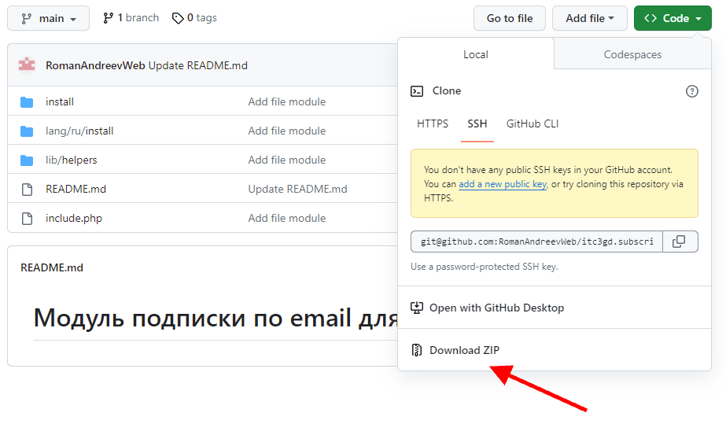
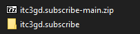
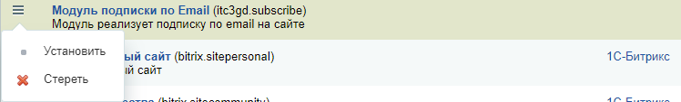
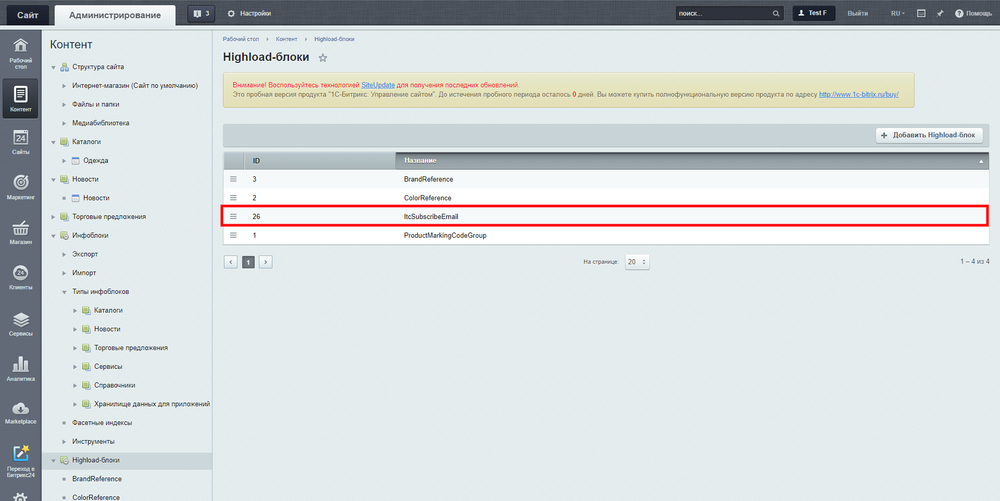
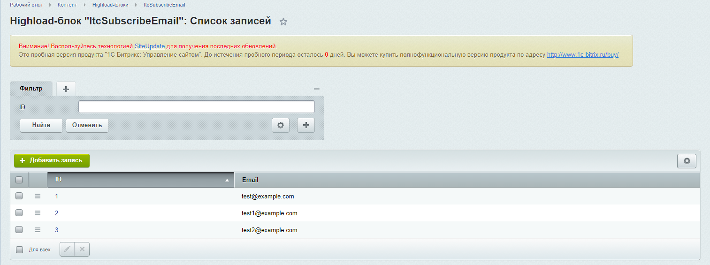
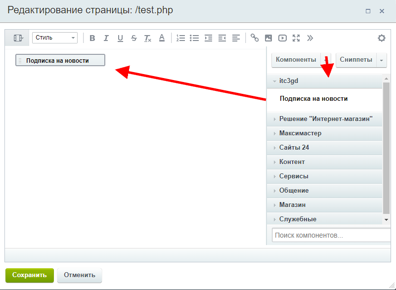
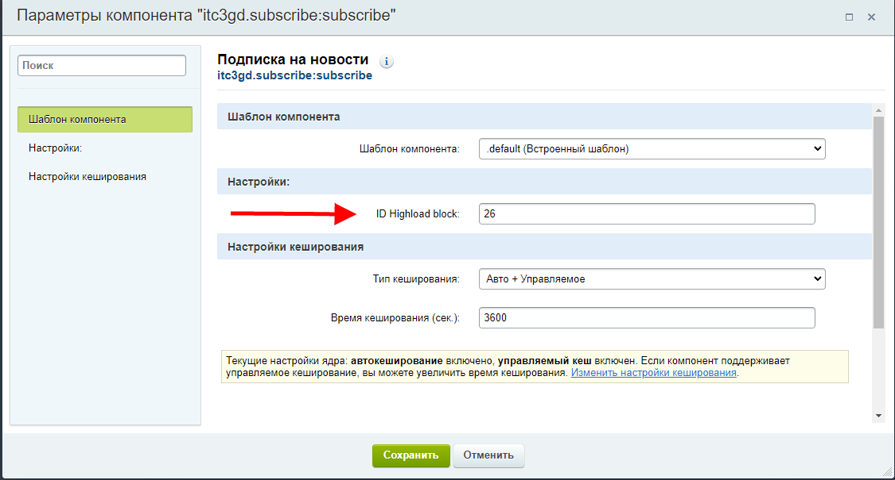
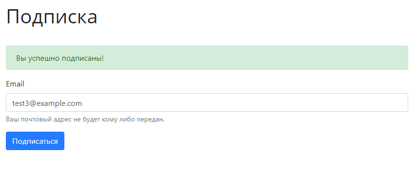
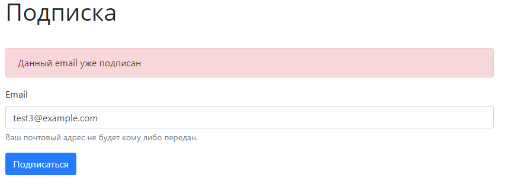

# Модуль подписки по email для 1C-Битрикс

## Инструкция по установке

1. Скачиваем модуль

2. Скачанный архив нужно переименовав убрав постфикс '-main'

3. Данный модуль нужно переместить в директорию на сайте: bitrix/modules

4. Далее на сайте в Marketplace -> Установленные решения. Необходимо установить модуль.

5. Email будут добавляться в HL-Блок

6. Далее создаем страницу, на который поместится компонент. Добавляем компонент.

7. Готово!

### При добавлении email:

### Если такой email ранее добавлялся

